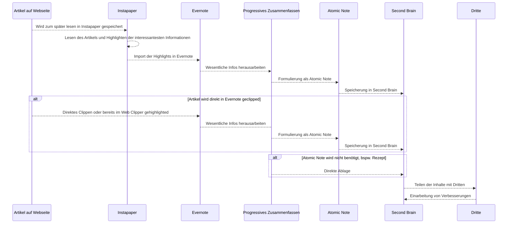

```mermaid
sequenceDiagram
    participant a as Artikel auf Webseite
    participant in as Instapaper
    participant en as Evernote
    participant ps as Progressives Zusammenfassen
    participant an as Atomic Note
    participant sb as Second Brain
    participant out as Dritte

    a -->> in: Wird zum später lesen in Instapaper gespeichert
    in -->> in: Lesen des Artikels und Highlighten der interessantesten Informationen
    in -->> en: Import der Highlights in Evernote
    en -->> ps: Wesentliche Infos herausarbeiten
    ps -->> an: Formulierung als Atomic Note
    an -->> sb: Speicherung in Second Brain

    alt Artikel wird direkt in Evernote geclipped
        a -->> en: Direktes Clippen oder bereits im Web Clipper gehighlighted
        en --> ps: Wesentliche Infos herausarbeiten
        ps -->> an: Formulierung als Atomic Note
        an -->> sb: Speicherung in Second Brain
    end

    alt Atomic Note wird nicht benötigt, bspw. Rezept
        ps -->> sb: Direkte Ablage
    end

    sb -->> out: Teilen der Inhalte mit Dritten
    out -->> sb: Einarbeitung von Verbesserungen
```

