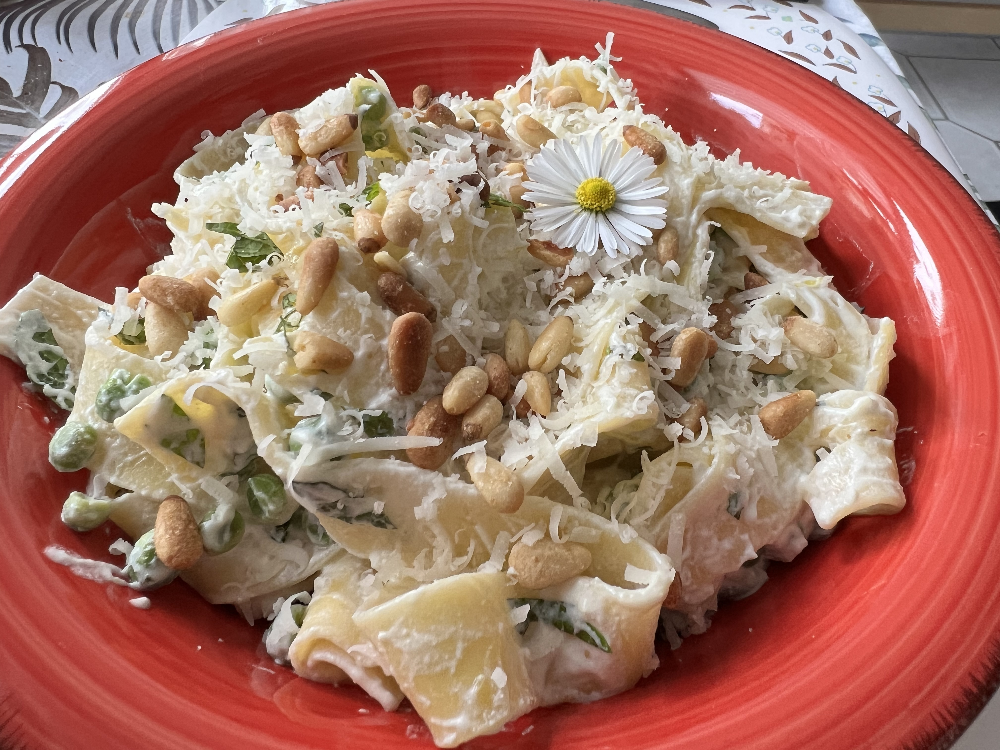

# Zitronenpasta mit Erbsen und Ricotta

## Zutaten für zwei Personen

|Zutat|Menge|
|:--|:-:|
|Pinienkerne|2 EL (gerne mehr)|
|Biozitrone|1|
|Minze|4-5 Stängel|
|Pasta (Bandnudeln)|200g|
|TK Erbsen|150g|
|Olivenöl|4 EL|
|Ricotta|150g|
|Parmesan|nach Lust|

